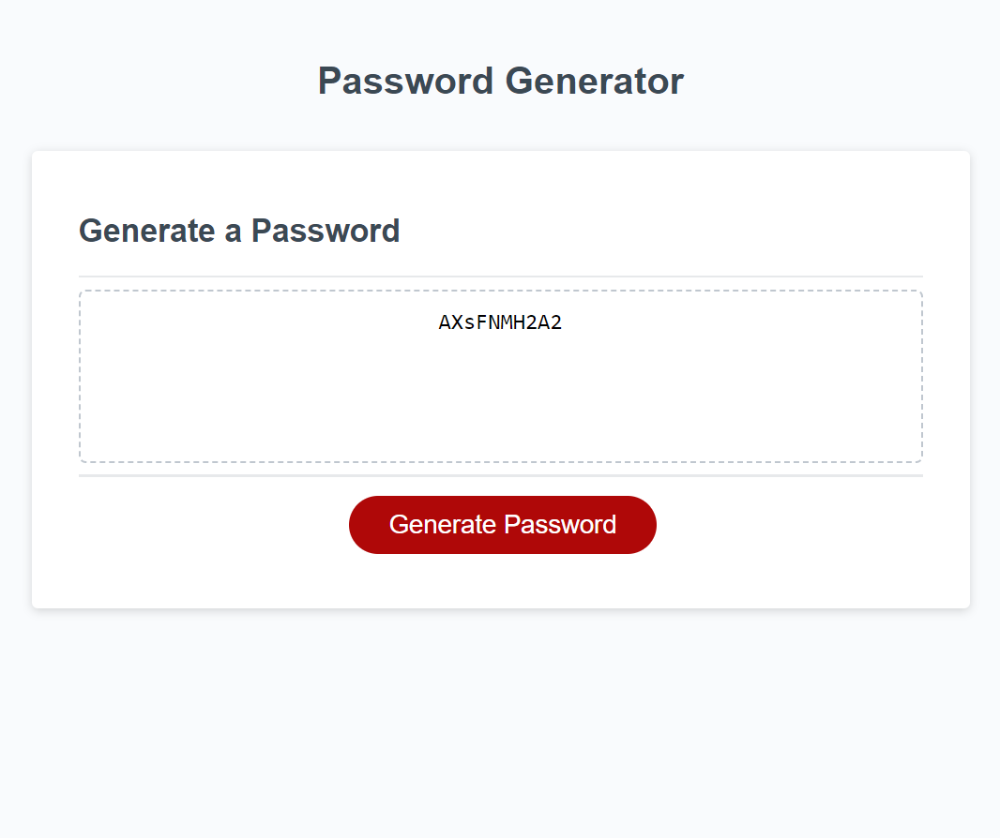

# Password Generator

## Description:

The primary goal of this project was to create a password generator that creates a password from random characters, given parameters the user selects.

## Instructions:

Upload index.html and assets folder to web browser. Assets folder contains stylesheet and script file.

## Links:

- [Webpage](https://lornaburns.github.io/password-generator-23/)
- [Repository](https://github.com/lornaburns/password-generator-23)

## Use:

This webpage is responsive on a range of screen sizes. The page can be refreshed to select different paramaters and generate new passwords.

## Image:

## Credits:

- [MDN] https://developer.mozilla.org/en-US/docs/Web/JavaScript/Reference/Global_Objects/Math/random
- [W3Schools] https://www.w3schools.com/js/js_popup.asp
